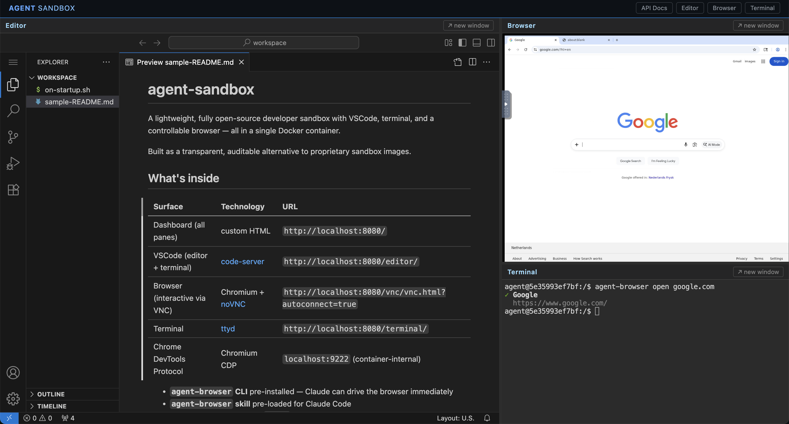

# agent-sandbox

A lightweight, fully open-source developer sandbox with VSCode, terminal, and a controllable browser — all in a single Docker container.

Built as a transparent, auditable alternative to proprietary sandbox images.



## What's inside

| Surface | Technology | URL |
|---------|-----------|-----|
| Dashboard (all panes) | custom HTML | `http://localhost:8080/` |
| VSCode (editor + terminal) | [code-server](https://github.com/coder/code-server) | `http://localhost:8080/editor/` |
| Browser (interactive via VNC) | Chromium + [noVNC](https://github.com/novnc/noVNC) | `http://localhost:8080/vnc/vnc.html?autoconnect=true` |
| Terminal | [ttyd](https://github.com/tsl0922/ttyd) | `http://localhost:8080/terminal/` |
| Chrome DevTools Protocol | Chromium CDP | `localhost:9222` (container-internal) |

- **`agent-browser` CLI** pre-installed — Claude can drive the browser immediately
- **`agent-browser` skill** pre-loaded for Claude Code
- **Chromium profile** named `agent` set as the default profile
- Single exposed port (`8080`) — nginx routes everything internally

## Quick start

Pull and run (shows live logs):

```bash
docker run --name agent-sandbox --shm-size=2gb --security-opt seccomp:unconfined -p 8080:8080 -v agent-workspace:/workspace ghcr.io/mafshin/agent-sandbox:latest
```

Run in background, then follow logs separately:

```bash
docker run -d --name agent-sandbox --shm-size=2gb --security-opt seccomp:unconfined -p 8080:8080 -v agent-workspace:/workspace ghcr.io/mafshin/agent-sandbox:latest
docker logs -f agent-sandbox
```

Or with docker compose:

```bash
docker compose up
```

Open **http://localhost:8080** for the dashboard (VSCode + browser + terminal in one view).
Or open panes individually: `/editor/` · `/vnc/vnc.html?autoconnect=true` · `/terminal/`

## Customising the sandbox

Edit `/workspace/on-startup.sh` in VSCode — it runs automatically every time the sandbox starts:

```bash
#!/bin/bash
# Install whatever you need
sudo apt-get install -y ffmpeg
pip install pandas matplotlib
npm install -g typescript
git clone https://github.com/you/your-project ~/workspace/your-project
```

The `/workspace` directory is a Docker volume — your script persists across restarts and image updates.

To run it without restarting:
```bash
bash /workspace/on-startup.sh
```

## Connecting a local VS Code to the sandbox

The sandbox runs **code-server** (browser-hosted VS Code). You can also connect your local VS Code installation directly to the container.

### Option A — Browser (no setup needed)

Open `http://localhost:8080/editor/` in your browser. Full VS Code experience, no installation required.

### Option B — Dev Containers (recommended for local VS Code)

Gives you native VS Code with your own extensions, themes, and keybindings, directly editing `/workspace` inside the container.

1. Install the [Dev Containers](https://marketplace.visualstudio.com/items?itemName=ms-vscode-remote.remote-containers) extension in your local VS Code.
2. Start the sandbox container (if not already running).
3. Open the Command Palette (`Ctrl+Shift+P` / `Cmd+Shift+P`) and run:
   ```
   Dev Containers: Attach to Running Container...
   ```
4. Select **agent-sandbox** from the list.
5. `/workspace` opens automatically.

> **Note:** Auto-open requires the container to be running from the current image. If you see "No Folder Opened", the container was created from an older image — remove it and create a fresh one:
> ```bash
> docker rm -f agent-sandbox
> docker run -d --name agent-sandbox --shm-size=2gb --security-opt seccomp:unconfined -p 8080:8080 -v agent-workspace:/workspace ghcr.io/mafshin/agent-sandbox:latest
> ```

Extensions installed inside the container persist only if you mount a volume for them.

### Option C — Remote SSH (advanced)

The container does not include an SSH server by default. To use Remote SSH, add `openssh-server` to the Dockerfile, expose port 22, and configure SSH keys for the `agent` user. Option B is simpler for most cases.

## Environment variables

| Variable | Default | Description |
|----------|---------|-------------|
| `PORT` | `8080` | Host port |
| `TZ` | `UTC` | Timezone |
| `WORKSPACE` | `/workspace` | Working directory |
| `DISPLAY_WIDTH` | `1280` | Browser/VNC width (px) |
| `DISPLAY_HEIGHT` | `1024` | Browser/VNC height (px) |

Copy `.env.example` to `.env` to override defaults.

## Using agent-browser with Claude

Chrome is already running and connected to CDP. In any Claude Code session inside the sandbox:

```bash
agent-browser connect 9222
agent-browser open https://example.com
agent-browser snapshot -i
```

The `agent-browser` skill is pre-loaded, so Claude will use it automatically when asked to browse or automate the web.

## Building locally

```bash
docker build -t agent-sandbox:dev .
docker run -d --shm-size=2gb --security-opt seccomp:unconfined -p 8080:8080 agent-sandbox:dev
```

## Architecture

```
supervisord (PID 1)
├── Xvfb          :99     Virtual display
├── Chromium      :9222   Browser (CDP) on Xvfb, profile: agent
├── x11vnc        :5900   VNC server — full keyboard + mouse input
├── websockify    :6080   WebSocket bridge for noVNC
├── ttyd          :7681   Web terminal (bash)
├── code-server   :8443   VSCode
└── nginx         :8080   Reverse proxy (single public port)
                           / → dashboard, /code/ → VSCode,
                           /vnc/ → noVNC, /terminal/ → ttyd
```

## License

This project is licensed under the **Apache License 2.0** — see [LICENSE](LICENSE) for the full text.

### Third-party components

The Docker image bundles the following open-source components. Each runs as a separate process and is not linked into this project's code.

| Component | License | Source |
|-----------|---------|--------|
| [code-server](https://github.com/coder/code-server) | MIT | github.com/coder/code-server |
| [noVNC](https://github.com/novnc/noVNC) | MPL-2.0 | github.com/novnc/noVNC |
| [websockify](https://github.com/novnc/websockify) | LGPL-3.0 | github.com/novnc/websockify |
| [ttyd](https://github.com/tsl0922/ttyd) | MIT | github.com/tsl0922/ttyd |
| [agent-browser](https://www.npmjs.com/package/agent-browser) | Apache-2.0 | npmjs.com/package/agent-browser |
| nginx | BSD-2-Clause | nginx.org |
| supervisor | BSD-derived | supervisord.org |
| Chromium | BSD + others | chromium.org |
| x11vnc | GPL-2.0 | libvncserver.github.io/LibVNCServer |

**Note on x11vnc (GPL-2.0):** x11vnc is installed as a standard Ubuntu apt package. Its source code is available via Ubuntu's package repositories, satisfying GPL-2.0 distribution requirements.
